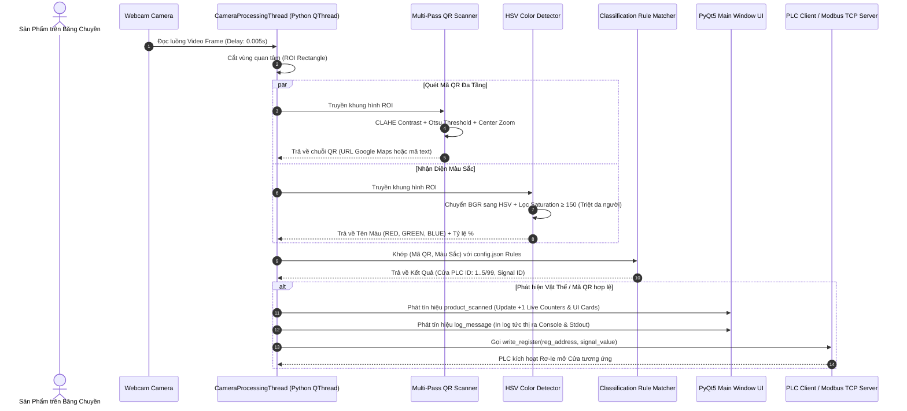

# 📘 TÀI LIỆU TOÀN DIỆN DỰ ÁN: NHẬT KÝ TIẾN TRÌNH & HƯỚNG DẪN SETUP MÁY MỚI

> **Tên dự án:** Hệ Thống Phân Loại Sản Phẩm Tự Động Bằng Mã QR & Màu Sắc Qua Webcam Kết Nối PLC (Industrial Conveyor Classifier System)  
> **Kiến trúc:** Python PyQt5 Desktop Application + Next.js Web Label Generator (Deploy Vercel)  
> **Tác giả:** DeepMind Agentic Pair Programming  
> **Ngày cập nhật:** 2026-07-29  

---

## 📋 MỤC LỤC
1. [Phần 1: Nhật Ký Tiến Trình & Các Cột Mốc Phát Triển Dự Án](#-phan-1-nhat-ky-tien-trinh--cac-cot-moc-phat-trien-du-an)
2. [Phần 2: Kiến Trúc Chi Tiết Các Phân Hệ](#-phan-2-kien-truc-chi-tiet-cac-phan-he)
3. [Phần 3: Hướng Dẫn Cài Đặt & Setup Từ Đầu Trên Máy Tính Mới](#-phan-3-huong-dan-cai-dat--setup-tu-dau-tren-may-tinh-moi)
4. [Phần 4: Quy Trình Đóng Gói Tự Động Ra File .EXE](#-phan-4-quy-trinh-dong-goi-tu-dong-ra-file-exe)
5. [Phần 5: Chi Tiết Cách Làm, Cách Hoạt Động & Logic Kỹ Thuật Dự Án](#-phan-5-chi-tiet-cach-lam-cach-hoat-dong--logic-ky-thuat-du-an)
6. [Phần 6: Bách Khoa Toàn Thư Hệ Thống - Dành Cho Người Không Biết Code](#-phan-6-bach-khoa-toan-thu-he-thong---danh-cho-nguoi-khong-biet-code)

---

# 📜 PHẦN 1: NHẬT KÝ TIẾN TRÌNH & CÁC CỘT MỐC PHÁT TRIỂN DỰ ÁN

Dưới đây là nhật ký chi tiết các yêu cầu và các cột mốc kỹ thuật đã đạt được trong quá trình xây dựng hệ thống:

| Cột mốc / Yêu cầu | Mô tả kỹ thuật & Giải pháp đã triển khai | Trạng thái |
| :--- | :--- | :---: |
| **1. Khởi tạo Desktop App** | Xây dựng ứng dụng Python PyQt5 kết hợp OpenCV quét Webcam real-time nhận diện mã QR và màu sắc. Kết nối Modbus TCP PLC với Server giả lập (PLCSimulator) tích hợp sẵn. | ✅ Complete |
| **2. Sửa lỗi Pymodbus 3.14+** | Khắc phục breaking change của Pymodbus bằng hàm `_call_modbus_method` tự động nhận diện tham số (`device_id` vs `slave` vs `unit`). | ✅ Complete |
| **3. Real-time Console Log** | In nhật ký quét sản phẩm tức thì ra cả giao diện GUI Console Log và màn hình Terminal stdout (`[QUÉT TỐC ĐỘ CAO]...`). | ✅ Complete |
| **4. Tối ưu Băng Chuyền Tốc Độ Cao** | Chuyển luồng camera sang chế độ quét siêu tốc: giảm độ trễ vòng lặp xuống `0.005s`, số frame xác nhận confidence = `1 frame` chớp là ăn ngay. | ✅ Complete |
| **5. Bộ đếm Nhảy Số (+1)** | Phát tín hiệu PyQt `product_scanned` giúp nhảy ngay bộ đếm trên các thẻ giao diện (Tổng SP, Cửa 1...5, Cửa loại) tức thì khi có vật thể trôi qua. | ✅ Complete |
| **6. Lọc Da Người (Skin Tone)** | Triệt tiêu hiện tượng quét mặt người bị nhầm thành màu Đỏ bằng cách nâng ngưỡng Saturation Min $S \ge 150$ và min ROI area $4\%$. | ✅ Complete |
| **7. Tem QR 5 Quận Đà Nẵng** | Tạo công cụ `tools/generate_qr_codes.py` sinh sẵn 5 tem dán cho Hải Châu, Thanh Khê, Liên Chiểu, Ngũ Hành Sơn, Cẩm Lệ. | ✅ Complete |
| **8. Web App Next.js** | Xây dựng ứng dụng Web Next.js (`qr-generator-web`) sử dụng App Router, TypeScript, TailwindCSS, in tem decal hàng loạt (`@media print`), sẵn sàng deploy Vercel. | ✅ Complete |
| **9. API 63 Tỉnh Thành Việt Nam** | Kết nối API công khai (`https://provinces.open-api.vn/api/`) tích hợp Form tra cứu 63 Tỉnh Thành & Quận Huyện toàn quốc tự động tạo mã QR phân loại. | ✅ Complete |
| **10. Mã QR Đa Năng Dual-Purpose** | Thiết kế định dạng QR chứa URL Google Maps: **Quét bằng ĐT** $\rightarrow$ Mở vị trí thực tế trên Google Maps; **Quét bằng Webcam** $\rightarrow$ Kích hoạt Cửa PLC. | ✅ Complete |
| **11. Số Nhà / Địa Chỉ Cụ Thể** | Thêm ô nhập Số nhà & Tên đường. ĐT quét mã sẽ ghim vị trí chính xác tới tận Số nhà trên Google Maps! | ✅ Complete |
| **12. Khử Chói Màn Hình ĐT** | Thêm bộ lọc tương phản **CLAHE** + **Otsu Binarization** trong `qr_scanner.py` và tối ưu ma trận ô QR thu gọn giúp đọc siêu nhạy từ màn hình ĐT/Lap. | ✅ Complete |
| **13. Đóng Gói 1 File EXE Duy Nhất** | Sử dụng PyInstaller `--onefile` đóng gói toàn bộ nhân Python, OpenCV, PyQt5 và DLLs thành `HeThongPhanLoaiPLC_SingleFile.exe` (chạy trên bất kỳ máy Windows nào không cần Python). | ✅ Complete |

---

# 🏗️ PHẦN 2: KIẾN TRÚC CHI TIẾT CÁC PHÂN HỆ

Hệ thống được chia làm 2 phân hệ chính hoạt động độc lập nhưng đồng bộ 100%:

```text
Ccc/
├── main.py                          # Entry point ứng dụng Desktop Python PyQt5
├── build_exe.py                     # Script đóng gói ứng dụng ra file .EXE độc lập
├── config.json                      # Cấu hình IP PLC, ngưỡng màu HSV và Quy tắc Phân loại
├── requirements.txt                 # Thư viện Python phục vụ phát triển
├── tools/
│   └── generate_qr_codes.py         # Tool Python tạo ảnh tem QR Google Maps
├── dist/
│   └── HeThongPhanLoaiPLC_SingleFile.exe  # FILE CHẠY ĐỘC LẬP CHO WINDOWS (0 SETUP)
├── src/
│   ├── vision/
│   │   ├── camera_thread.py         # Luồng xử lý camera tốc độ cao (0.005s delay)
│   │   ├── color_detector.py        # Nhận diện màu sắc không gian HSV (Khử da người)
│   │   └── qr_scanner.py            # Quét QR đa tầng (Multi-pass CLAHE + Binarization)
│   ├── plc/
│   │   ├── modbus_client.py         # Client Modbus TCP truyền tín hiệu sang PLC
│   │   └── plc_simulator.py         # Server Modbus TCP giả lập kiểm thử
│   └── ui/
│       └── main_window.py           # Giao diện Desktop UI Industrial Dark Theme
└── qr-generator-web/                # 🌐 ỨNG DỤNG WEB GENERATOR (NEXT.JS + VERCEL)
    ├── src/app/page.tsx             # Form tra cứu API 63 Tỉnh Thành & In tem hàng loạt
    ├── src/app/globals.css          # Style CSS & Cấu hình in ấn print layout
    └── vercel.json                  # File cấu hình deploy 1-click Vercel
```

---

# 💻 PHẦN 3: HƯỚNG DẪN CÀI ĐẶT & SETUP TỪ ĐẦU TRÊN MÁY TÍNH MỚI

Khi bạn mang dự án sang một **máy tính mới tinh (chưa có phần mềm hay Python nào)**, bạn có 2 cách triển khai:

### ⚡ CÁCH A: CHẠY TRỰC TIẾP BẰNG FILE .EXE ĐỘC LẬP (0 SETUP)
1. **Bước 1:** Sao chép duy nhất file sau sang máy tính Windows:
   `c:\Users\dayla\Downloads\Ccc\dist\HeThongPhanLoaiPLC_SingleFile.exe`
2. **Bước 2:** Bấm đúp chuột vào tệp `HeThongPhanLoaiPLC_SingleFile.exe`.
3. **Hoàn tất!** Không cần cài Python, không cần tải bất kỳ thư viện nào!

---

### 🛠️ CÁCH B: CÀI ĐẶT MÔI TRƯỜNG LẬP TRÌNH TỪ ĐẦU (DEVELOPER GUIDE)
1. **Cài Python 3.11** (⚠️ *Bắt buộc tích chọn "Add python.exe to PATH"*).
2. **Cài Node.js 18+**.
3. **Setup Python App:**
   ```bash
   pip install -r requirements.txt
   python main.py
   ```
4. **Setup Web App:**
   ```bash
   cd qr-generator-web
   npm install
   npm run dev
   ```

---

# 📦 PHẦN 4: QUY TRINH ĐÓNG GÓI TỰ ĐỘNG RA FILE .EXE

```bash
python build_exe.py
```
Tệp `.exe` mới sẽ tự động được xuất ra tại `dist\HeThongPhanLoaiPLC_SingleFile.exe`.

---

# 🔬 PHẦN 5: CHI TIẾT CÁCH LÀM, CÁCH HOẠT ĐỘNG & LOGIC KĨ THUẬT DỰ ÁN

## 🎯 1. Luồng Hoạt Động Tổng Thể (System Sequence Flow)



---

# 📚 PHẦN 6: BÁCH KHOA TOÀN THƯ HỆ THỐNG - DÀNH CHO NGƯỜI KHÔNG BIẾT CODE

> **Mục tiêu:** Phần này được viết theo phong cách **Bách Khoa Toàn Thư trực quan bằng hình ảnh và ví dụ thực tế**, giúp các quản lý nhà xưởng, kỹ thuật viên điện hay bất kỳ ai không biết lập trình đều hiểu 100% cách hệ thống vận hành.

---

## 🏭 1. Sơ Đồ Vật Lý Hệ Thống Băng Chuyền Nhà Xưởng (Physical Hardware Layout)

Hãy hình dung toàn bộ hệ thống trong nhà xưởng như một **Bưu cục giao hàng tự động**:

```text
               [BĂNG CHUYỀN CHẠY TỪ TRÁI SANG PHẢI ->]
===================================================================================
 (Thùng Hàng)     [ MẮT THẦN WEBCAM ]  (Khung Hình Xem ROI)
   [📦 1]  --->     [ 📷 Camera ]    --->   [  ROI  ] 
===================================================================================
                         │
                         ▼ (Dây cáp USB)
               ┌───────────────────┐
               │  MÁY TÍNH ĐIỀU KHIỂN │
               │ (Chạy phần mềm   │
               │  SingleFile.exe)  │
               └─────────┬─────────┘
                         │
                         ▼ (Dây cáp mạng LAN / Modbus TCP)
               ┌───────────────────┐
               │   TỦ ĐIỆN PLC     │ (Cổng PLC Holding Register 0)
               └────┬───┬───┬───┬──┘
                    │   │   │   │
        ┌───────────┘   │   │   └───────────┐
        ▼               ▼   ▼               ▼
   [ CỬA 1 ]       [ CỬA 2 ] [ CỬA 3 ] ... [ CỬA LOẠI (REJECT) ]
 (Cần gạt Piston) (Gạt Xanh) (Gạt Dương)   (Thùng rác sản phẩm lỗi)
 (Cửa Hải Châu)  (Cửa Thanh Khê)
```

### Cách hoạt động từng bước trên Băng Chuyền:
1. **Thùng hàng** mang tem QR hoặc sơn màu trôi trên Băng Chuyền đi qua **Mắt Thần Webcam**.
2. **Webcam** chụp lại 200 tấm ảnh mỗi giây và gửi về **Máy Tính Điều Khiển**.
3. **Phần mềm Máy Tính** soi ảnh, đọc chữ trên tem QR và nhìn màu thùng hàng.
4. Ngay khi nhận ra thùng hàng (VD: Tem Quận Hải Châu), Máy Tính bắn tín hiệu qua **Dây Mạng LAN** tới **Tủ Điện PLC**.
5. **PLC** ra lệnh cho **Cần gạt Piston** đẩy thùng hàng ngã vào **Cửa số 1**!

---

## 🧠 2. Sơ Đồ "Bộ Não" Phần Mềm & Các Tín Hiệu

Nếu so sánh phần mềm như một **Con Người**, thì các phần trong code hoạt động như sau:

```text
 ┌─────────────────────────────────────────────────────────────────────────┐
 │                        CON NGƯỜI VẬN HÀNH                               │
 ├───────────────────┬───────────────────┬─────────────────────────────────┤
 │  Bộ phận cơ thể   │  Tên trong Code   │          Nhiệm vụ chính         │
 ├───────────────────┼───────────────────┼─────────────────────────────────┤
 │ 👁️ Mắt Quan Sát   │ `camera_thread`   │ Chụp 200 ảnh/giây không ngừng nghỉ│
 │ 🔍 Kính Chống Lóa │ `qr_scanner`      │ Lọc bóng sáng, đọc mã QR cực rõ │
 │ 🎨 Mắt Nhìn Màu   │ `color_detector`  │ Nhận diện Đỏ, Xanh (Bỏ da người)│
 │ 🧠 Bộ Não Trí Nhớ │ `config.json`     │ Nhớ luật: Mã Hải Châu -> Cửa 1  │
 │ 🗣️ Miệng Ra Lệnh │ `modbus_client`   │ Hét lệnh qua cáp LAN cho PLC    │
 │ 📺 Bảng Đồng Hồ   │ `main_window.py`  │ Hiện số thùng hàng nhảy +1      │
 └───────────────────┴───────────────────┴─────────────────────────────────┘
```

---

## 💡 3. Giải Thích 4 Thuật Toán Kỹ Thuật Bằng Ví Dụ Đời Thường

---

### 💡 Ví dụ 1: Thuật toán "Triệt Da Người" (Skin-Tone Filter)

* **Vấn đề thực tế:** Khi công nhân đứng làm việc gần băng chuyền, tay hoặc mặt công nhân lỡ giơ trước camera. Nếu camera nhầm mặt người là "Thùng Hàng Màu Đỏ", PLC sẽ gạt nhầm!
* **Cách phần mềm giải quyết (Kính Râm Thông Minh):**
  - Màu Đỏ của vỏ nhựa thùng hàng rất **"Rực rỡ"** (Độ bão hòa Saturation rất cao $S \ge 150$).
  - Màu da mặt người dù hồng hay đỏ thì vẫn là màu **"Nhạt nhòa"** (Saturation thấp $S \le 140$).
  - Phần mềm đeo một chiếc *"Kính Râm Thông Minh"*: Tất cả những gì nhạt nhòa như da mặt người sẽ bị biến thành màu xám và **BỎ QUA**. Chỉ có màu Đỏ rực rỡ của thùng hàng mới làm Kính Râm bật báo động!

```text
 [ KHUNG HÌNH CAMERA ]
   ├── Giơ Mặt Người  ---> Saturation = 90  (< 150) ---> ❌ BỎ QUA (Không gạt cửa)
   └── Thùng Hàng Đỏ ---> Saturation = 210 (≥ 150) ---> ✅ KÍCH HOẠT CỬA 1!
```

---

### 💡 Ví dụ 2: Thuật toán "Chống Chói Bóng Điện Thoại" (CLAHE Filter)

* **Vấn đề thực tế:** Khi bạn giơ màn hình điện thoại trước Webcam, bóng đèn tuýp nhà xưởng chiếu vào kính điện thoại tạo thành vệt sáng chói lóa làm mờ mã QR.
* **Cách phần mềm giải quyết (Kính Chống Lóa Phi Công):**
  - Phần mềm chạy qua bước lọc **CLAHE**: Tự động dập tắt các vệt sáng chói lóa, làm đậm các ô đen trắng của mã QR.
  - Mã QR sau khi lọc trở nên cực kỳ sắc nét giúp camera chớp được mã trong $0.005$ giây!

---

### Ví dụ 3: Chuẩn Truyền Thông PLC Modbus TCP (Đường Hotline 24/7)

* **Vấn đề thực tế:** Làm sao máy tính ra lệnh cho PLC Siemens/Mitsubishi mà PLC hiểu được?
* **Cách phần mềm giải quyết:**
  - Máy tính và PLC nói chuyện với nhau qua đường cáp mạng LAN bằng ngôn ngữ **Modbus TCP**.
  - Phần mềm giống như một Tổng đài viên: Mỗi khi đọc được tem Hải Châu, Tổng đài viên nhấc máy gọi Hotline PLC và ghi số `1` vào **Hòm thư (Holding Register 0)**.
  - PLC thấy Hòm thư xuất hiện số `1` liền kích hoạt Rơ-le điện nguồn mở Cửa 1!

---

### 💡 Ví dụ 4: Mã QR Đa Năng 2 Ngôn Ngữ (Dual-Purpose QR Code)

* **Vấn đề thực tế:** Bạn muốn 1 mã QR duy nhất dán trên thùng hàng phải vừa phục vụ **Máy tính băng chuyền phân loại**, vừa phục vụ **Shipper giao hàng bằng Điện thoại**!
* **Cách phần mềm giải quyết (Chiếc Hộ Chiếu 2 Ngôn Ngữ):**
  - Nội dung nhúng trong mã QR: `https://maps.google.com/?q=123+Nguyen+Van+Linh#DISTRICT_HAI_CHAU`

```text
                    ┌───────────────────────────────┐
                    │     MÃ QR DÁN TRÊN THÙNG HÀNG │
                    └───────────────┬───────────────┘
                                    │
           ┌────────────────────────┴────────────────────────┐
           ▼                                                 ▼
[ 📱 ĐIỆN THOẠI SHIPPER QUÉT ]                      [ 🏭 WEBCAM PHẦN MỀM PLC QUÉT ]
 - ĐT đọc đoạn URL `https://maps...`                 - Phần mềm đọc đuôi `#DISTRICT_HAI_CHAU`
 - Tự mở ứng dụng Google Maps                       - Khớp luật config.json
 - Chỉ đường ghim tận **Số nhà 123 Nguyễn Văn Linh**   - Phát tín hiệu bắn PLC gạt vào **Cửa 1**!
```

---

## 🖨️ 4. Hướng Dẫn Vận Hành Web In Tem Hàng Loạt Next.js

Dự án đi kèm một trang Web chuyên dụng giúp nhân viên văn phòng/kho bãi in tem dán hàng:

1. **Tra cứu 63 Tỉnh Thành:** Chọn Tỉnh/Thành phố và Quận/Huyện bất kỳ tại Việt Nam.
2. **Nhập Số Nhà Chi Tiết:** Nhập số nhà, tên đường giao hàng.
3. **Gán Cửa PLC:** Chọn cửa phân loại mong muốn (Cửa 1, 2, 3, 4, 5...).
4. **Bấm In Tem Hàng Loạt:** Trang web tự động dàn trang thẻ tem decal sắc nét, bấm **`Ctrl + P`** hoặc nút **In Tem** để xuất ra máy in tem nhiệt dán lên thùng hàng!

---

### 🌟 TỔNG KẾT BÁCH KHOA TOÀN THƯ
Hệ thống là sự kết hợp hoàn hảo giữa **Thị Giác Máy Tính Tốc Độ Cao**, **Tự Động Hóa Truyền Thông PLC Nhà Xưởng** và **Công Nghệ Web Logistics Hiện Đại**, đáp ứng trọn vẹn từ khâu In tem dán, Phân loại tự động trên băng chuyền cho đến Giao hàng tận tay người tiêu dùng!
